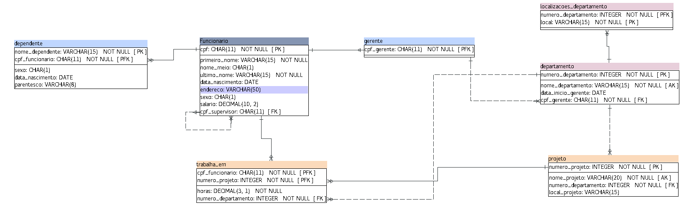

# Problem Set 2
## Este Pset consiste em fazer um scrpit com consultas ao banco de dados UVV criado no [Pset1](https://github.com/BernardoAbaurre/uvv_bd_1_cc1m/tree/main/pset1).
### _Esquema do banco de dados UVV:_

